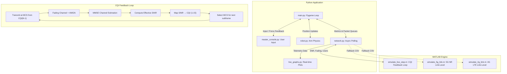

# 5G Telesurgery Network Simulation

This project is a high-fidelity, real-time interactive simulation that compares the performance of 4G LTE and 5G NR networks in the context of remote robotic surgery. It is built using Python (Pygame) for the surgical simulation interface and MATLAB Engine for real-time network physical layer computations.

## Overview

The goal of this simulation is to visually and mechanically demonstrate the strict network requirements for URLLC (Ultra-Reliable Low-Latency Communication) applications like remote surgery. The simulation contrasts the high latency, jitter, and packet loss inherent in 4G networks against the ultra-low latency, high reliability, and smoothness of a 5G network.

### Key Features
*   **Real-time MATLAB Engine Integration:** Live computation of network metrics (BLER, throughput, latency, jitter) via background polling.
*   **True CQI Feedback Loop (Link Adaptation):** The simulation implements a real 3GPP-standard Channel Quality Indicator feedback mechanism. After each subframe, the receiver measures the Effective SINR (which inherently captures ISI, fading dips, and thermal noise), maps it to a CQI index (1–15), and feeds it back to the transmitter. The transmitter then selects the optimal Modulation & Coding Scheme (QPSK, 16QAM, or 64QAM) for the next subframe — exactly as a real eNodeB/gNodeB would.
*   **Realistic Channel Fading:** Supports three switchable fading environments: **Pedestrian** (EPA/TDL-A), **Vehicular** (EVA/TDL-B), and **Urban** (ETU/TDL-C). The Urban profile's severe delay spread causes ISI that naturally degrades the CQI, forcing the network to adapt without any hardcoded overrides.
*   **Multi-User Network Congestion:** Simulates the effect of 1–100+ concurrent users sharing the cell's bandwidth. More users means less throughput per user, higher scheduling latency, and increased jitter — all of which degrade surgical precision.
*   **Dynamic Jitter Mechanics (Micro-Stutters):** High network jitter causes the robot arm to periodically "freeze" (packet burst delays), making precision tasks organically difficult on 4G.
*   **Tissue Density Force Feedback:** The simulation calculates varying force resistance based on "tissue density". Veering off the surgical path inside dense tissue applies a massive penalty multiplier.
*   **Live Comparison Graphs:** A parallel multiprocessing window displays rolling live plots of BLER, Latency, Throughput, and Jitter, actively comparing 4G and 5G performance.
*   **Strict Precision Requirements:** The surgeon must complete 100% of the complex, serpentine incision path without letting their moving accuracy average drop below 90%.

## Architecture



The project is split into the Python Frontend and the MATLAB Backend.

*   `main.py`: The core Pygame application loop. Handles rendering, input, accuracy tracking, and the micro-stutter networking mechanic.
*   `network.py`: Manages the non-blocking asynchronous MATLAB Engine. Handles simulated network packet queues, latency injection, and polling of live metrics. Passes SNR, fading profile, and user count to MATLAB each frame.
*   `live_graphs.py`: Uses Python `multiprocessing` to run a separate `matplotlib` window that visualizes telemetry data without blocking the Pygame UI thread.
*   `robot.py` / `master_console.py`: Handles the physical state of the slave robot arm and the master surgical controller.
*   `simulate_live_step.m`: The primary MATLAB script called continuously by Python. Implements the full CQI feedback loop: transmits using the previous CQI-selected MCS, passes through a fading channel, estimates the channel, computes Effective SINR, maps to a new CQI, and persists it for the next call. Uses persistent state to maintain channel continuity across frames.
*   `simulate_5g_link.m` & `simulate_4g_link.m`: Standalone MATLAB scripts for generating fallback CSV datasets. Contain full link-level simulations with CQI-based AMC over TDL (5G) and EPA/EVA/ETU (4G) channel models.

## Network Realism

### CQI-to-MCS Mapping (3GPP TS 36.213)
| CQI Index | Modulation | Approx. Code Rate | Typical Scenario |
|-----------|-----------|-------------------|-----------------|
| 1–6       | QPSK      | 0.08 – 0.59       | Cell edge, Urban fading, low SNR |
| 7–9       | 16QAM     | 0.37 – 0.60       | Mid-cell, moderate conditions |
| 10–15     | 64QAM     | 0.46 – 0.93       | Near tower, clean channel |

### Fading Profiles
| Profile     | 4G Model | 5G Model | Max Delay Spread | Typical Environment |
|------------|----------|----------|-----------------|-------------------|
| Pedestrian | EPA      | TDL-A    | ~410 ns         | Indoor, slow mobility |
| Vehicular  | EVA      | TDL-B    | ~2.5 µs         | Highway, moderate speed |
| Urban      | ETU      | TDL-C    | ~5.0 µs         | Dense urban, reflections off buildings |

> **Note:** The Urban (ETU) profile's 5.0 µs delay spread exceeds the 4G Normal Cyclic Prefix length of 4.7 µs, causing severe Inter-Symbol Interference (ISI). The CQI feedback loop naturally detects this degradation and restricts 4G to QPSK, even at high thermal SNR. 5G survives better due to its 4-antenna spatial diversity.

### Multi-User Impact
| Parameter  | Effect of Adding Users |
|-----------|----------------------|
| Throughput | Bandwidth (PRBs) divided among users. 50 users → ~2% of peak throughput per user. |
| Latency    | Scheduling queue grows. Each additional user adds ~0.5 ms (4G) or less (5G). |
| Jitter     | Scheduling variability increases. 4G jitter scales at 0.2 ms/user vs. 0.05 ms/user for 5G. |

## How to Run

### Prerequisites
*   Python 3.8+
*   MATLAB (R2023a or newer recommended) with the 5G Toolbox and LTE Toolbox.
*   Python `matlabengine` API installed (`pip install matlabengine`).
*   Pygame, NumPy, Matplotlib.

### Execution
Run the simulation by executing:
```bash
python main.py
```

### Controls
| Key | Action |
|-----|--------|
| `1` | Switch to 5G NR at 25 dB SNR (Ideal) |
| `2` | Switch to 5G NR at 15 dB SNR (Cell Edge) |
| `3` | Switch to 4G LTE at 25 dB SNR |
| `4` | Switch to 4G LTE at 15 dB SNR |
| `U` | Increase active users (+5) |
| `J` | Decrease active users (-5) |
| `F` | Cycle fading profile (Pedestrian → Vehicular → Urban) |
| `G` | Toggle Live Metrics Graph Window |
| `C` | Toggle In-Game HUD Comparison Mode |
| `R` | Manually restart the surgical procedure |

## Gameplay Mechanics

Your objective is to trace the glowing green surgical path from start to finish with the highest possible precision. 
*   **Safe Zone:** You have a 5-pixel safe radius. Staying within this radius incurs no penalties.
*   **Dense Tissue (Red Zones):** If you stray outside the safe radius while inside a dense tissue zone, the accuracy penalty is amplified by up to 4x based on force resistance.
*   **4G vs 5G Impact:** If you attempt the surgery on 4G, high latency will cause your scalpel to lag behind your cursor, and high jitter will cause unpredictable "Signal Stalled" micro-freezes. This combination makes navigating the tight switchbacks without failing nearly impossible. Switching to 5G eliminates the lag and stutter, providing a 1:1 control experience.
*   **Urban Fading:** Switching to the Urban fading profile will cause the CQI to plummet. On 4G, the ISI will force the network down to QPSK with severe throughput loss. On 5G, the extra antennas help, but you'll still see degradation. This demonstrates why dedicated network slicing and controlled environments are critical for real telesurgery.
*   **Network Congestion:** Adding users simulates a shared cell. Even 5G URLLC suffers under extreme congestion. Try the surgery at 50 users on 4G to see the network completely buckle.
